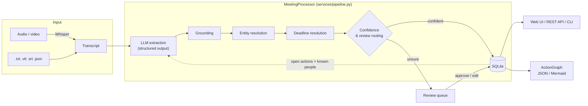

# ActionGraph

**LLM-powered meeting intelligence that turns conversations into trackable, reviewable work.**


Most meeting tools *summarise*. ActionGraph *extracts and tracks*. It reads a
transcript (or audio), pulls out **decisions, action items, owners, deadlines
and risks** as validated structured data, resolves "Priya", "Priya S." and
"@priya" to one person, converts "by Friday" into a real date, and follows each
action **across meetings**: created → blocked → done. Anything the system is
not sure about goes to a **human review queue** instead of silently becoming a
task.

```text
"We'll update the API design by Friday. Priya will handle the authentication
 changes. Sam, please share the user research by Wednesday."
```

becomes

```json
{
  "actions": [
    {"task": "Update the API design",              "owner": "Team",         "due_date": "2026-09-11"},
    {"task": "Implement the authentication changes", "owner": "Priya Sharma", "due_date": null},
    {"task": "Share the user research",            "owner": "Sam Lee",      "due_date": "2026-09-09"}
  ]
}
```

…and two meetings later:

```text
#1 Handle the authentication changes (owner: Priya Sharma)
   2026-09-07  Sprint 14 Planning   created          open
   2026-09-14  Sprint 14 Sync       status_changed   open -> blocked
               "The authentication changes are blocked."
   2026-09-21  Sprint 14 Review     status_changed   blocked -> done
               "Authentication is completed."
```

---

## Table of contents

- [Features](#features)
- [Architecture at a glance](#architecture-at-a-glance)
- [Quickstart](#quickstart)
- [Using ActionGraph](#using-actiongraph)
- [Project structure](#project-structure)
- [Evaluation results](#evaluation-results)
- [Tech stack](#tech-stack)
- [Documentation](#documentation)
- [Roadmap](#roadmap)

## Features

| # | Capability | How it works | Code |
|---|-----------|--------------|------|
| 1 | **Speech-to-text** | Audio/video → transcript with Whisper (`faster-whisper`), plus `.txt` / `.vtt` / `.srt` / `.json` transcripts | [`ingestion/`](src/actiongraph/ingestion) |
| 2 | **LLM extraction** | Claude reads the transcript plus the open work from earlier meetings | [`extraction/anthropic_extractor.py`](src/actiongraph/extraction/anthropic_extractor.py) |
| 3 | **Structured output** | A Pydantic schema becomes a JSON schema the API *guarantees* the reply follows | [`domain/schemas.py`](src/actiongraph/domain/schemas.py) |
| 4 | **Entity resolution** | "Priya", "Priya S.", "@priya", `priya.sharma@acme.com` → one person; ambiguous names go to review | [`enrichment/entity_resolution.py`](src/actiongraph/enrichment/entity_resolution.py) |
| 5 | **Temporal understanding** | "by Friday", "end of next week", "in 2 weeks" → dates, computed by deterministic code | [`enrichment/temporal.py`](src/actiongraph/enrichment/temporal.py) |
| 6 | **Cross-meeting tracking** | Status updates, postponements, duplicate detection, risk → blocked-action links | [`services/tracking.py`](src/actiongraph/services/tracking.py) |
| 7 | **Human-in-the-loop** | Confidence + evidence grounding + resolution checks decide what needs a human | [`enrichment/confidence.py`](src/actiongraph/enrichment/confidence.py) |
| + | **Hallucination check** | Every item must quote the transcript; quotes that are not there get flagged | [`enrichment/grounding.py`](src/actiongraph/enrichment/grounding.py) |
| + | **Evaluation harness** | Precision / recall / F1 on a hand-labelled dataset, including a held-out case | [`evaluation/`](src/actiongraph/evaluation) |
| + | **Offline mode** | A rule-based extractor runs the whole system with no API key | [`extraction/rule_based.py`](src/actiongraph/extraction/rule_based.py) |

## Architecture at a glance



The LLM does what LLMs are good at (understanding messy language). Plain,
tested code does what must be exact (dates, identity, verification). See
[docs/architecture/ARCHITECTURE.md](docs/architecture/ARCHITECTURE.md).

## Quickstart

Requires **Python 3.11+**. Commands are shown for Windows PowerShell; macOS /
Linux equivalents are in [docs/guides/GETTING_STARTED.md](docs/guides/GETTING_STARTED.md).

```powershell
# 1. Create and activate a virtual environment
py -3.12 -m venv .venv
.\.venv\Scripts\Activate.ps1

# 2. Install ActionGraph with development tools
pip install -e ".[dev]"

# 3. Configure (the default .env.example uses the free offline extractor)
Copy-Item .env.example .env

# 4. Run the three-meeting demo - no API key needed
actiongraph demo --provider offline

# 5. Run the tests
pytest
```

To use Claude for real extraction, put your key in `.env`:

```ini
ACTIONGRAPH_LLM_PROVIDER=anthropic
ANTHROPIC_API_KEY=sk-ant-...
```

then `actiongraph demo --provider anthropic`.

## Using ActionGraph

**Web UI**: `actiongraph serve`, then open http://127.0.0.1:8000. Paste or
upload a meeting, browse actions with their timelines, work through the review
queue, and explore the interactive graph.

**REST API**: interactive docs at http://127.0.0.1:8000/docs. See
[docs/api/API_REFERENCE.md](docs/api/API_REFERENCE.md).

**CLI**:

```text
actiongraph process meeting.vtt --date 2026-09-22   process one file (text, subtitles or audio)
actiongraph actions [--status blocked]              list tracked work
actiongraph timeline 3                              one action's history across meetings
actiongraph review                                  what needs a human, and why
actiongraph approve action 6 / reject event 11      human-in-the-loop decisions
actiongraph people                                  people and every spelling merged into them
actiongraph graph --output graph.md                 the ActionGraph as a Mermaid diagram
actiongraph eval --provider anthropic               measure extraction quality
```

## Project structure

```text
.
├── src/actiongraph/
│   ├── domain/          Enums + the LLM output schema (the "contract")
│   ├── ingestion/       Files and audio → Transcript
│   ├── extraction/      Transcript → structured data (Claude, or offline rules)
│   ├── enrichment/      Grounding, entity resolution, dates, confidence (pure functions)
│   ├── storage/         SQLAlchemy tables + Repository (all queries)
│   ├── services/        Pipeline orchestration, cross-meeting tracking, review
│   ├── graph/           Nodes/edges for visualisation; Mermaid export
│   ├── evaluation/      Precision/recall/F1 harness
│   ├── api/             FastAPI app, routes, request/response schemas
│   ├── web/             Single-page UI (HTML/CSS/JS, no build step)
│   └── cli.py           Typer command-line interface
├── tests/
│   ├── unit/            Fast tests of pure logic (no DB, no network)
│   └── integration/     Pipeline, review, API and CLI against a temp database
├── evals/               Hand-labelled evaluation dataset
├── samples/             Example meetings (a 3-week storyline + a .vtt file)
└── docs/                Design doc, ADRs, architecture, guides, concepts
```

## Evaluation results

Offline rule-based baseline on the golden dataset (`actiongraph eval --provider offline`):

| Case | Action F1 | Status-update F1 | Decision F1 | Risk F1 |
|------|----------:|-----------------:|------------:|--------:|
| 01–05 (transcripts the rules were written against) | 0.96 | 0.95 | 1.00 | 0.75 |
| **06 held-out "messy standup"** | **0.00** | – | **0.00** | **0.00** |
| Total (micro-averaged) | 0.84 | 0.95 | 0.91 | 0.67 |

The baseline looks excellent on data it was tuned on and **fails completely on
natural speech it has never seen**. That is overfitting, and it is the reason
this project uses an LLM. Run `actiongraph eval --provider anthropic` to
measure Claude on the same cases; the method and how to read the numbers are in
[docs/guides/EVALUATION.md](docs/guides/EVALUATION.md).

## Tech stack

| Layer | Choice | Why |
|-------|--------|-----|
| Language | Python 3.11+ | The LLM/ML ecosystem lives here |
| LLM | Claude (`claude-opus-5-5`) via the official `anthropic` SDK | Structured outputs, prompt caching, server-side refusal fallback |
| Schemas | Pydantic v2 | One model = JSON schema for the LLM + validation of its reply |
| API | FastAPI + Uvicorn | Typed, async-capable, auto-generated OpenAPI docs |
| Storage | SQLAlchemy 2.0 + SQLite | Zero setup; swap the URL for PostgreSQL later ([ADR-0003](docs/adr/0003-relational-storage-for-the-graph.md)) |
| Speech-to-text | faster-whisper (optional) | Runs Whisper locally on CPU; no ffmpeg install needed |
| CLI | Typer + Rich | Type-hinted commands, readable tables |
| UI | Vanilla JS + vis-network | No build step, so beginners can read every line |
| Quality | pytest, pytest-cov, ruff, GitHub Actions | Tests, coverage, lint + format in CI |

## Documentation

Start with **[docs/LEARNING_PATH.md](docs/LEARNING_PATH.md)**, a guided,
step-by-step tour of the codebase for beginners. Everything else is indexed in
**[docs/README.md](docs/README.md)**:

- [Technical design document](docs/design/DESIGN.md): goals, non-goals, design, alternatives, risks
- [Architecture](docs/architecture/ARCHITECTURE.md) · [Pipeline walkthrough](docs/architecture/PIPELINE.md) · [Data model](docs/architecture/DATA_MODEL.md)
- [Architecture Decision Records](docs/adr/README.md): why each major choice was made
- [Concepts](docs/concepts/README.md): structured outputs, grounding, entity resolution, temporal reasoning, HITL, …
- Guides: [Getting started](docs/guides/GETTING_STARTED.md) · [Development](docs/guides/DEVELOPMENT.md) · [Configuration](docs/guides/CONFIGURATION.md) · [Testing](docs/guides/TESTING.md) · [Evaluation](docs/guides/EVALUATION.md) · [Prompt engineering](docs/guides/PROMPT_ENGINEERING.md)
- [API reference](docs/api/API_REFERENCE.md) · [Runbook](docs/operations/RUNBOOK.md) · [Glossary](docs/GLOSSARY.md)

## Roadmap

- [ ] Speaker diarization for audio (who said what), e.g. `pyannote.audio`
- [ ] Background job queue so long recordings don't block HTTP requests
- [ ] Semantic matching (embeddings / LLM-as-judge) in evaluation and duplicate detection
- [ ] Alembic migrations and PostgreSQL deployment
- [ ] Integrations: push approved actions to Jira / Linear / Slack reminders
- [ ] Authentication and multi-team workspaces

## License

[MIT](LICENSE)
