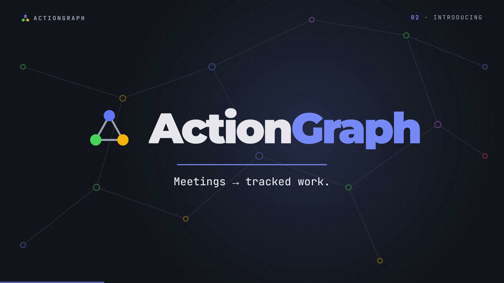
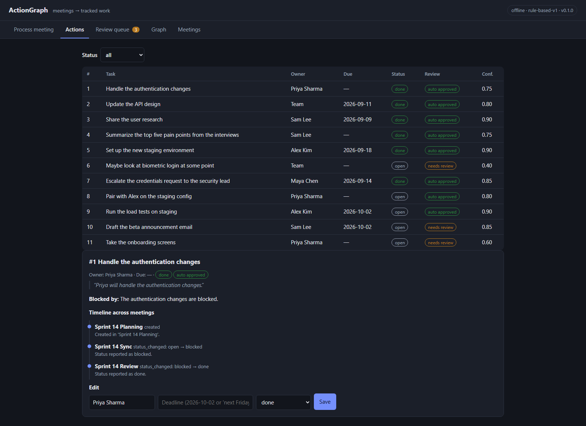
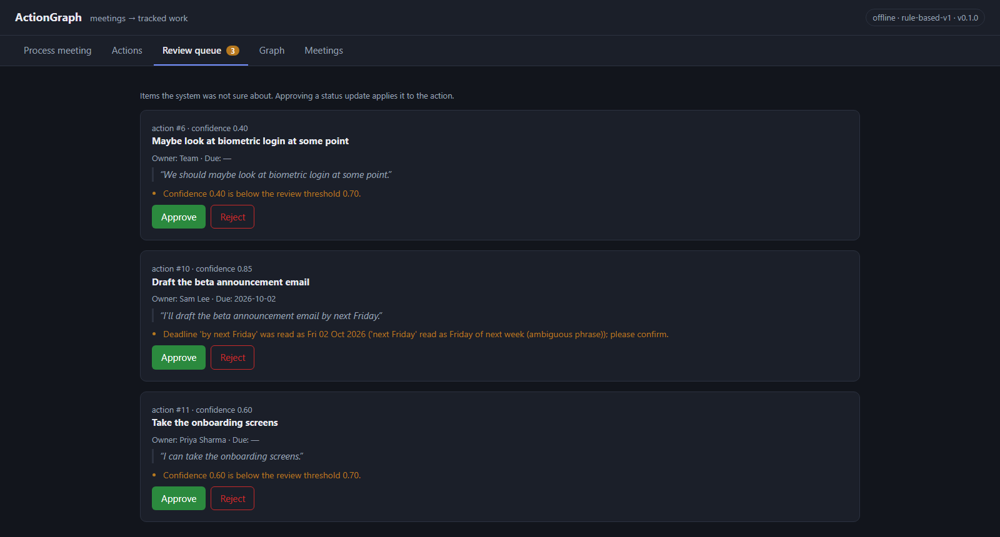
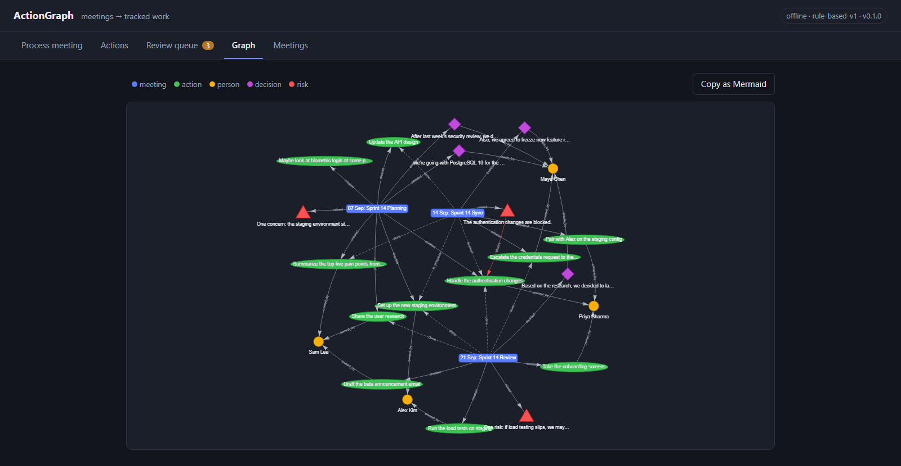
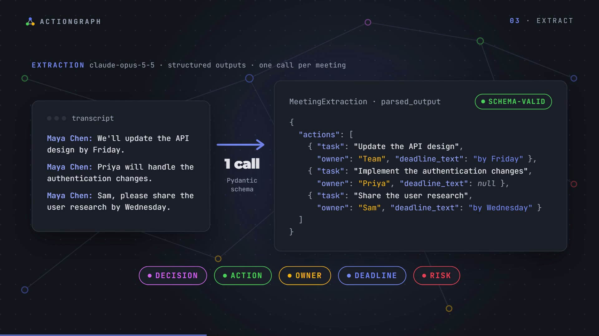
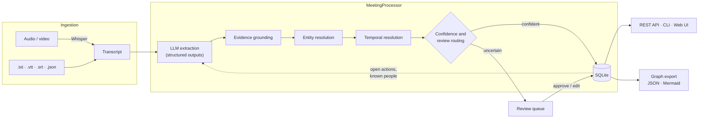

<div align="center">



# ActionGraph

**LLM-powered meeting intelligence that converts conversations into structured, verifiable, trackable work.**

[](https://github.com/satyaidk/Action-Graph/actions/workflows/ci.yml)
[](pyproject.toml)
[](docs/guides/TESTING.md)
[](docs/guides/TESTING.md#coverage)
[](https://github.com/astral-sh/ruff)
[](LICENSE)

[Overview](#overview) •
[Demo](#demo) •
[Architecture](#architecture) •
[Getting started](#getting-started) •
[Documentation](docs/README.md) •
[Design doc](docs/design/DESIGN.md) •
[Contributing](CONTRIBUTING.md)

</div>

---

## Overview

ActionGraph ingests meeting recordings and transcripts and produces a structured record of what
was decided and who committed to what. Every extracted item (decision, action item, owner,
deadline, risk) is validated against a typed schema, grounded in a verbatim quote from the
transcript, and then either approved automatically or routed to a human review queue with an
explanation. Action items are tracked across later meetings, so their status moves from *open*
to *blocked* to *done* as the team reports progress.

The system pairs a large language model with deterministic engineering. The model interprets
informal speech; tested code performs everything that must be exact: date arithmetic, identity
resolution, evidence verification and review routing.

| Transcript (meeting on Mon 7 Sep 2026) | Tracked action |
|---|---|
| `Maya Chen: We'll update the API design by Friday.` | **Update the API design** · owner *Team* · due *2026-09-11* |
| `Maya Chen: Priya will handle the authentication changes.` | **Handle the authentication changes** · owner *Priya Sharma* |
| `Maya Chen: Sam, please share the user research by Wednesday.` | **Share the user research** · owner *Sam Lee* · due *2026-09-09* |

## Key features

- **Multi-format ingestion.** Plain-text, WebVTT, SRT and JSON transcripts; audio and video through local Whisper transcription (`faster-whisper`).
- **Schema-constrained extraction.** Claude structured outputs bound to a Pydantic contract; responses always parse and are validated before use.
- **Evidence grounding.** Every item carries a verbatim quote that is checked against the source transcript to detect hallucinated content.
- **Entity resolution.** `Priya`, `Priya S.`, `@priya` and `priya.sharma@acme.com` resolve to one person; ambiguous names are flagged, never guessed.
- **Temporal resolution.** Phrases such as *by Friday* or *end of next week* resolve deterministically to dates, each with a confidence score and an explanation.
- **Cross-meeting tracking.** Status and deadline updates, duplicate folding, superseded proposals and risk-to-action links, stored as an auditable event history.
- **Human-in-the-loop review.** Uncertain items are queued with plain-English reasons; approving a pending status update applies it.
- **Three interfaces.** REST API (FastAPI, OpenAPI docs), command-line interface, and a web UI with an interactive graph view.
- **Evaluation harness.** Precision, recall and F1 on a hand-labelled dataset that includes a held-out case.
- **Offline mode.** A rule-based extractor runs the complete system without an API key.

## Demo

**[Watch the 60-second narrated walkthrough](brag-output/brag.mp4)** (1080p, built with HyperFrames from the project's own sample data).

<table>
  <tr>
    <td width="50%" valign="top">
      
      <p><sub><b>Action tracker.</b> Action #1 moves from <i>open</i> to <i>blocked</i> to <i>done</i> across three meetings; each change links to the meeting and quote that caused it.</sub></p>
    </td>
    <td width="50%" valign="top">
      
      <p><sub><b>Review queue.</b> Items the system was not confident about, each with the reason it was flagged.</sub></p>
    </td>
  </tr>
  <tr>
    <td width="50%" valign="top">
      
      <p><sub><b>Graph view.</b> Meetings, actions, people, decisions and risks; the red edge marks a blocker.</sub></p>
    </td>
    <td width="50%" valign="top">
      
      <p><sub><b>Extraction.</b> One structured-output call converts a transcript into schema-valid data.</sub></p>
    </td>
  </tr>
</table>

<sub>Screenshots are captured from the bundled demo dataset (`actiongraph demo --provider offline`).</sub>

## Architecture



| Layer | Responsibility | Package |
|---|---|---|
| Domain | Shared vocabulary and the LLM output contract | `domain/` |
| Ingestion | Any input format → `Transcript` | `ingestion/` |
| Extraction | `Transcript` → `MeetingExtraction` (Claude or offline rules) behind one interface | `extraction/` |
| Enrichment | Pure, deterministic checks: grounding, people, dates, confidence | `enrichment/` |
| Storage | SQLAlchemy models and a repository of named queries | `storage/` |
| Services | Pipeline orchestration, cross-meeting tracking, review workflow | `services/` |
| Interfaces | REST API, CLI and web UI | `api/`, `cli.py`, `web/` |

Dependencies point inward only, so core logic is testable without a database or network and the
LLM provider can be replaced without touching the pipeline. Processing a meeting is a single
transaction: the LLM call runs before any write, and any failure rolls back cleanly.

Further reading: [Architecture](docs/architecture/ARCHITECTURE.md) ·
[Pipeline walkthrough](docs/architecture/PIPELINE.md) ·
[Data model](docs/architecture/DATA_MODEL.md)

## Getting started

### Prerequisites

- Python 3.11 or 3.12
- Git
- Optional: an [Anthropic API key](https://platform.claude.com/) for LLM extraction (the offline extractor needs none)

### Installation

```bash
git clone https://github.com/satyaidk/Action-Graph.git
cd Action-Graph

python -m venv .venv
source .venv/bin/activate            # Windows PowerShell: .\.venv\Scripts\Activate.ps1

pip install -e ".[dev]"              # add ",audio" for speech-to-text: pip install -e ".[dev,audio]"
cp .env.example .env                 # Windows PowerShell: Copy-Item .env.example .env
```

### Configuration

Settings are read from environment variables or `.env`. The most important ones:

| Variable | Default | Description |
|---|---|---|
| `ACTIONGRAPH_LLM_PROVIDER` | `anthropic` | `anthropic` for Claude, `offline` for the rule-based extractor (`.env.example` uses `offline`) |
| `ANTHROPIC_API_KEY` | — | API key used when the provider is `anthropic` |
| `ACTIONGRAPH_ANTHROPIC_MODEL` | `claude-opus-5-5` | Model identifier |
| `ACTIONGRAPH_REVIEW_THRESHOLD` | `0.7` | Items below this confidence are sent to review |
| `ACTIONGRAPH_DATABASE_URL` | `sqlite:///data/actiongraph.db` | Any SQLAlchemy database URL |

Full reference: [docs/guides/CONFIGURATION.md](docs/guides/CONFIGURATION.md).

### Run

```bash
actiongraph demo --provider offline      # process the three bundled sample meetings
actiongraph serve --db data/demo.db      # web UI: http://127.0.0.1:8000 · API docs: /docs
```

## Usage

### Command-line interface

| Command | Purpose |
|---|---|
| `actiongraph process <file> [--date YYYY-MM-DD]` | Process a transcript, subtitle or audio file |
| `actiongraph actions [--status blocked]` | List tracked action items |
| `actiongraph timeline <id>` | Show an action's history across meetings |
| `actiongraph review` | List items awaiting review, with reasons |
| `actiongraph approve <kind> <id>` / `reject <kind> <id>` | Resolve a review item |
| `actiongraph people` | List people and every name variant merged into them |
| `actiongraph graph [--output graph.md]` | Export the graph as a Mermaid diagram |
| `actiongraph eval --provider <name>` | Score extraction quality on the labelled dataset |
| `actiongraph serve` | Start the REST API and web UI |

### REST API

```bash
curl -X POST http://127.0.0.1:8000/api/meetings \
  -H "Content-Type: application/json" \
  -d '{"title": "Team sync", "meeting_date": "2026-10-05",
       "transcript": "Ana Ruiz: I will send the deck by Friday."}'
```

| Endpoint | Description |
|---|---|
| `POST /api/meetings` · `POST /api/meetings/upload` | Process a pasted transcript or an uploaded file |
| `GET /api/actions` · `GET /api/actions/{id}` · `PATCH /api/actions/{id}` | Track, inspect and correct action items |
| `GET /api/review` · `POST /api/review/{kind}/{id}/approve` | Human-in-the-loop review |
| `GET /api/graph` · `GET /api/graph/mermaid` | Graph as JSON or Mermaid |

Full reference with request and response examples: [docs/api/API_REFERENCE.md](docs/api/API_REFERENCE.md).
Interactive OpenAPI documentation is served at `/docs` while the server is running.

## Project structure

```text
.
├── src/actiongraph/
│   ├── domain/          Enums and the LLM output schema (the extraction contract)
│   ├── ingestion/       Transcript parsers and Whisper speech-to-text
│   ├── extraction/      Extractor interface, Claude extractor, offline extractor, prompts
│   ├── enrichment/      Grounding, entity resolution, temporal resolution, confidence
│   ├── storage/         SQLAlchemy models, engine/session setup, repository
│   ├── services/        Meeting pipeline, cross-meeting tracking, review workflow
│   ├── graph/           Graph construction and Mermaid export
│   ├── evaluation/      Metrics and evaluation runner
│   ├── api/             FastAPI application, routes and schemas
│   ├── web/             Single-page web UI (HTML, CSS, JavaScript)
│   └── cli.py           Typer command-line interface
├── tests/               Unit and integration tests
├── evals/               Hand-labelled evaluation dataset
├── samples/             Sample meetings (three-week storyline and a WebVTT export)
├── docs/                Design doc, ADRs, architecture, guides, concepts
└── brag-output/         Source and render of the demo video (HyperFrames)
```

## Testing and quality

| Check | Scope | Command |
|---|---|---|
| Unit tests | 119 tests of pure logic: dates, names, grounding, scoring, parsing, extractors | `pytest tests/unit` |
| Integration tests | 41 tests of the pipeline, review workflow, REST API and CLI on a temporary database | `pytest tests/integration` |
| Live API test | Real Claude extraction; opt-in, skipped by default | `ACTIONGRAPH_LIVE_TESTS=1 pytest -m live` |
| Coverage | 96% line coverage | `pytest --cov` |
| Lint and format | Ruff | `ruff check src tests` · `ruff format --check src tests` |
| Continuous integration | Ubuntu and Windows × Python 3.11 and 3.12 | [`.github/workflows/ci.yml`](.github/workflows/ci.yml) |

The test suite needs no network access: the LLM layer is exercised through a scripted fake
extractor and a fake SDK client. Model *quality* is measured separately by the evaluation harness.
See [docs/guides/TESTING.md](docs/guides/TESTING.md).

## Evaluation

Results of the offline rule-based baseline on the six labelled cases
(`actiongraph eval --provider offline`):

| Cases | Action F1 | Owner accuracy | Deadline accuracy | Status-update F1 | Decision F1 | Risk F1 |
|---|---:|---:|---:|---:|---:|---:|
| 01–05 (used while writing the rules) | 0.96 | 1.00 | 1.00 | 0.95 | 1.00 | 0.75 |
| 06 (held out, informal speech) | 0.00 | — | — | — | 0.00 | 0.00 |
| **Total (micro-averaged)** | **0.84** | 1.00 | 1.00 | 0.95 | 0.91 | 0.67 |

The baseline performs well on the transcripts it was tuned against and fails on unseen informal
speech, a measured illustration of overfitting and the motivation for LLM extraction. Run
`actiongraph eval --provider anthropic` to score Claude on the same cases. Methodology:
[docs/guides/EVALUATION.md](docs/guides/EVALUATION.md).

## Design decisions

Significant decisions are recorded as Architecture Decision Records:

| ADR | Decision |
|---|---|
| [0002](docs/adr/0002-python-fastapi-sqlite-stack.md) | Python, FastAPI and SQLAlchemy/SQLite as the base stack |
| [0003](docs/adr/0003-relational-storage-for-the-graph.md) | Store the graph in relational tables rather than a graph database |
| [0004](docs/adr/0004-structured-outputs.md) | Use structured outputs with a Pydantic schema for extraction |
| [0005](docs/adr/0005-deterministic-temporal-resolution.md) | The model copies deadline phrases; deterministic code resolves dates |
| [0006](docs/adr/0006-confidence-based-human-review.md) | Route uncertain items to human review with explicit reasons |
| [0007](docs/adr/0007-pluggable-extractors-and-offline-mode.md) | Extractor interface with an offline implementation |

## Documentation

| Document | Contents |
|---|---|
| [Design document](docs/design/DESIGN.md) | Goals, non-goals, detailed design, alternatives, risks |
| [Architecture](docs/architecture/ARCHITECTURE.md) · [Pipeline](docs/architecture/PIPELINE.md) · [Data model](docs/architecture/DATA_MODEL.md) | How the system is built and how data flows |
| [Concepts](docs/concepts/README.md) | Structured outputs, grounding, entity resolution, temporal reasoning, human-in-the-loop |
| [Guides](docs/guides/GETTING_STARTED.md) | Getting started, development, configuration, testing, evaluation, prompt engineering |
| [API reference](docs/api/API_REFERENCE.md) · [Runbook](docs/operations/RUNBOOK.md) · [Glossary](docs/GLOSSARY.md) | Reference and operations |
| [Learning path](docs/LEARNING_PATH.md) | A guided, stage-by-stage tour of the codebase |

## Roadmap

- [ ] Speaker diarization for audio input (`pyannote.audio`)
- [ ] Asynchronous processing with a job queue for long recordings
- [ ] Semantic matching (embeddings or LLM-as-judge) for evaluation and duplicate detection
- [ ] Alembic migrations and PostgreSQL deployment profile
- [ ] Integrations: push approved actions to Jira, Linear or GitHub Issues
- [ ] Authentication and multi-team workspaces

## Contributing

Contributions are welcome. Read [CONTRIBUTING.md](CONTRIBUTING.md) for the development workflow,
coding conventions and pull-request checklist, and follow the [Code of Conduct](CODE_OF_CONDUCT.md).

## Security

Please report vulnerabilities privately as described in [SECURITY.md](SECURITY.md).

## License

Distributed under the MIT License. See [LICENSE](LICENSE).

## Acknowledgements

- [Anthropic Claude](https://www.anthropic.com/) and the official Python SDK, for structured-output extraction
- [FastAPI](https://fastapi.tiangolo.com/), [SQLAlchemy](https://www.sqlalchemy.org/), [Pydantic](https://docs.pydantic.dev/), [Typer](https://typer.tiangolo.com/) and [Rich](https://github.com/Textualize/rich)
- [faster-whisper](https://github.com/SYSTRAN/faster-whisper) for local speech-to-text
- [vis-network](https://visjs.github.io/vis-network/docs/network/) for the graph view
- Demo video produced with [HyperFrames](https://hyperframes.heygen.com/); sound effects by [Kenney](https://kenney.nl/) (CC0); music from ende.app's *Happy Beats / Business Moves*
