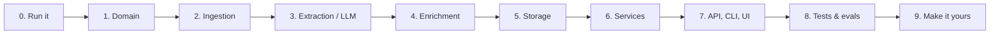

# Learning path: understand ActionGraph from zero

**Audience:** a beginner software engineer who knows basic Python (functions,
classes, lists/dicts) and wants to understand every file, the architecture and
the LLM techniques in this project well enough to explain them in an interview
and to extend them alone.

**How to use this guide:** go stage by stage. Each stage lists *what to read*
(in order), *the concepts you will meet*, *questions to check yourself*, and
*an exercise*. Do the exercises in a git branch; the tests tell you whether
you broke anything. Budget roughly 1–2 evenings per stage.



The order follows the **dependency direction**: each stage only uses things
from earlier stages, so you never read code that depends on something you
have not seen yet.

---

## Stage 0: Run it before you read it

Observing behaviour first gives you a mental model to hang the code on.

```powershell
actiongraph demo --provider offline     # processes 3 meetings, prints timelines
actiongraph review --db data/demo.db    # what the system was unsure about
actiongraph people --db data/demo.db    # name variants merged into people
actiongraph serve --db data/demo.db     # open http://127.0.0.1:8000
pytest -v                               # 160 tests, read their names
```

Then read the three sample meetings in `samples/transcripts/` and compare them
with what the demo printed. Write down three things that surprised you.

**Check yourself:** Why did "Draft the beta announcement email" end up in the
review queue even though its owner and task are clear? (Hint: look at its
deadline.)

---

## Stage 1: The domain: shared vocabulary

| Read | What it is |
|------|------------|
| `src/actiongraph/domain/enums.py` | Every status and type name used in the system |
| `src/actiongraph/domain/schemas.py` | **The LLM output contract** (the most important file in the project) |

**Concepts:** `StrEnum`, type hints (`str | None`), Pydantic models and
`Field(description=...)`, why the domain layer imports nothing else.

**Key insight:** in `schemas.py` the `description=` strings are *read by the
LLM*. They are part of the prompt. Changing a description changes model
behaviour, and it is version-controlled and reviewed like code.

**Check yourself**
1. Why is `deadline_text` a string and not a `date`?
2. Why must every item carry `evidence`?
3. Why are nullable fields still *required*?

Answers: [concepts/01-structured-outputs.md](concepts/01-structured-outputs.md),
[ADR-0004](adr/0004-structured-outputs.md), [ADR-0005](adr/0005-deterministic-temporal-resolution.md).

**Exercise:** add a `priority: Literal["low", "medium", "high"]` field to
`ExtractedAction`. Run `pytest`, see what breaks, and fix the test helpers in
`tests/conftest.py`. (You will meet the same field again in Stage 5.)

---

## Stage 2: Ingestion: any input → `Transcript`

| Read | What it is |
|------|------------|
| `ingestion/transcript.py` | `Segment` and `Transcript` dataclasses; "Speaker: text" parsing |
| `ingestion/loaders.py` | One small parser per file format; `load_transcript()` dispatches on extension |
| `ingestion/speech_to_text.py` | Whisper transcription (optional dependency, imported lazily) |
| `tests/unit/test_loaders.py` | How each format is expected to behave |

**Concepts:** `@dataclass`, regular expressions, the *adapter* idea (many
formats in, one shape out), lazy imports for heavy optional dependencies,
`utf-8-sig` and the Windows byte-order mark.

**Check yourself**
1. What happens to a line with no `Speaker:` prefix?
2. Why are consecutive subtitle cues from the same speaker merged?
3. Why can't audio transcripts attribute "I'll do it" to anyone?

**Exercise:** support transcripts where speakers look like `[Priya]: text`.
Write the test first (`tests/unit/test_loaders.py`), watch it fail, then make
it pass. That is test-driven development (TDD).

---

## Stage 3: Extraction: where the LLM lives

| Read (in this order) | What it is |
|------|------------|
| `extraction/base.py` | The `Extractor` **Protocol** + request/result dataclasses |
| `extraction/prompts.py` | System prompt + how the per-meeting message is built |
| `extraction/anthropic_extractor.py` | The Claude call: structured outputs, caching, stop reasons, error mapping |
| `extraction/rule_based.py` | The offline regex baseline (skim it, and notice how brittle it gets) |
| `extraction/factory.py` | Chooses an implementation from settings |
| `tests/unit/test_anthropic_extractor.py` | Testing LLM code **without** calling the LLM |

**Concepts:** dependency inversion (code depends on the `Extractor`
interface, not on Claude), structured outputs, prompt caching, `stop_reason`
handling (`refusal`, `max_tokens`), translating library exceptions into your
own error types, fakes in tests.

**Read next:** [concepts/01-structured-outputs.md](concepts/01-structured-outputs.md),
[guides/PROMPT_ENGINEERING.md](guides/PROMPT_ENGINEERING.md),
[ADR-0007](adr/0007-pluggable-extractors-and-offline-mode.md).

**Check yourself**
1. Where is the JSON format described to the model? (Trick question: it is not in the prompt.)
2. What would happen if we read `response.parsed_output` without checking `stop_reason`?
3. How does `test_anthropic_extractor.py` test error handling with no network?

**Exercise:** with an API key, run `actiongraph eval --provider anthropic`.
Then change one sentence in `SYSTEM_PROMPT`, run it again, and compare. You
have just done prompt engineering the professional way: one change, measured.

---

## Stage 4: Enrichment: deterministic checks on LLM output

| Read | What it is |
|------|------------|
| `enrichment/text_utils.py` | Normalisation and similarity (used everywhere) |
| `enrichment/grounding.py` | Is the quoted evidence really in the transcript? |
| `enrichment/entity_resolution.py` | "Priya S." → Priya Sharma, with a refusal to guess |
| `enrichment/temporal.py` | "by Friday" → a date, with confidence and an explanation |
| `enrichment/confidence.py` | All signals → auto-approve or human review |
| `tests/unit/test_temporal.py`, `test_entity_resolution.py`, … | The specification, written as tests |

**Concepts:** pure functions (same input → same output, no side effects),
`difflib.SequenceMatcher`, ordered rule lists, calibrated confidence,
"explainability" (every decision carries a reason a human can read).

**Read next:** [concepts/03-grounding-and-hallucinations.md](concepts/03-grounding-and-hallucinations.md),
[concepts/04-entity-resolution.md](concepts/04-entity-resolution.md),
[concepts/05-temporal-reasoning.md](concepts/05-temporal-reasoning.md),
[concepts/06-human-in-the-loop.md](concepts/06-human-in-the-loop.md).

**Check yourself**
1. Why is "next Friday" given a low confidence?
2. Two people named Priya exist. What does `resolve("Priya")` return, and why is that *better* than picking one?
3. Why is the combined confidence `min(llm_confidence, grounding)` when grounding fails?

**Exercise:** make "end of sprint" resolvable by adding a `sprint_end` date
to `resolve_deadline()` (default `None` = unresolvable). Add parametrised
test cases first.

---

## Stage 5: Storage: tables, sessions, queries

| Read | What it is |
|------|------------|
| `storage/models.py` | SQLAlchemy ORM tables and relationships |
| `storage/database.py` | Engine, sessions, SQLite foreign keys |
| `storage/repository.py` | Every query, named after what it means |
| [architecture/DATA_MODEL.md](architecture/DATA_MODEL.md) | ER diagram + state machines |

**Concepts:** ORM, primary/foreign keys, one-to-many relationships,
sessions as a *unit of work*, `flush` vs `commit`, the Repository pattern,
why a graph can live in relational tables ([ADR-0003](adr/0003-relational-storage-for-the-graph.md)).

**Check yourself**
1. What is an `ActionEvent`, and why are status changes stored as events rather than just overwriting `status`?
2. Why does `open_actions()` include items still waiting for review?

**Exercise:** finish the `priority` field from Stage 1: add a column to
`ActionItem`, save it in the pipeline, return it from the API. Delete
`data/*.db` afterwards (there are no migrations yet; see the Roadmap).

---

## Stage 6: Services: the pipeline that ties it together

| Read | What it is |
|------|------------|
| `services/pipeline.py` | **Read `MeetingProcessor._process` top to bottom**, since it mirrors the architecture diagram |
| `services/tracking.py` | Duplicates, applying status updates, superseding stale proposals |
| `services/review.py` | Approve / reject / edit |
| [architecture/PIPELINE.md](architecture/PIPELINE.md) | The same flow with example data at every stage |
| `tests/integration/test_pipeline.py` | A three-meeting story as a test |

**Concepts:** orchestration vs. logic (the pipeline *calls* tested
functions; it contains little logic itself), transactions (all-or-nothing),
why the slow LLM call happens before any database write.

**Read next:** [concepts/07-cross-meeting-tracking.md](concepts/07-cross-meeting-tracking.md).

**Check yourself**
1. What happens to the database if the LLM call fails? Which test proves it?
2. The model returns a status update for action id 999 that does not exist. What happens?
3. What does "superseded" mean, and when is it set?

**Exercise:** add `report.timings` (seconds per stage) to `ProcessingReport`
using `time.perf_counter()`, and print it in the CLI. This is how real
systems find bottlenecks.

---

## Stage 7: Interfaces: API, CLI and web UI

| Read | What it is |
|------|------------|
| `api/app.py` | App *factory*, exception → HTTP status mapping, static UI |
| `api/deps.py` | Dependency injection (sessions, settings, extractor) |
| `api/schemas.py` | Public request/response models (separate from DB tables!) |
| `api/routes/*.py` | Thin handlers that call services |
| `cli.py` | The same services from the terminal |
| `web/app.js` | Vanilla JS calling the API; note `esc()` against XSS |

**Concepts:** REST, HTTP status codes (404, 409, 415, 422, 502), dependency
injection, why API schemas are separate from ORM models, cross-site scripting
(XSS) and output escaping.

**Check yourself**
1. Why does an LLM failure return **502** and not 500?
2. Why is the app built by `create_app()` instead of a global `app = FastAPI()`?
3. What would happen in the UI if `esc()` were removed and a transcript contained ``?

**Exercise:** add `GET /api/actions/overdue` (status not closed, `due_date`
before today). Add a repository method, a route and an API test.

---

## Stage 8: Quality: tests and evaluation

| Read | What it is |
|------|------------|
| `tests/conftest.py` | Fixtures, the `FakeExtractor`, test-data builders |
| [guides/TESTING.md](guides/TESTING.md) | Test pyramid and conventions |
| `src/actiongraph/evaluation/` + `evals/` | Precision / recall / F1 on labelled meetings |
| [guides/EVALUATION.md](guides/EVALUATION.md) | How to read the numbers, and the overfitting lesson |

**Concepts:** unit vs. integration tests, fakes vs. mocks, fixtures,
coverage, why LLM *quality* is measured with evals and not unit tests,
precision vs. recall, held-out data, overfitting.

**Check yourself**
1. Why does the offline baseline score 0.96 F1 on cases 01–05 but 0.00 on case 06?
2. Would you rather improve precision or recall for this product? Why?

**Exercise:** write a new eval case from a real meeting you attended (anonymise
it). Label it *before* running any extractor on it.

---

## Stage 9: Make it yours (project ideas)

Ordered from easier to harder; each one is a good portfolio talking point.

1. **Overdue reminders:** a CLI command that lists overdue actions per owner.
2. **Export to CSV / Markdown:** a meeting minutes document generated from the DB.
3. **Speaker diarization:** add `pyannote.audio` so audio transcripts have speaker names.
4. **Semantic duplicate detection:** replace `similarity()` with embeddings and compare eval results.
5. **LLM-as-judge evaluation:** use a second model call to judge whether a predicted task matches a gold task.
6. **Background jobs:** process uploads asynchronously and poll for status.
7. **Integrations:** push approved actions to Jira, Linear or GitHub Issues.

When you finish one, write an ADR for the main decision you made. That is
exactly what engineers do on real teams.

**Next:** [PORTFOLIO_GUIDE.md](PORTFOLIO_GUIDE.md) shows how to present
this project on your resume and in interviews.
