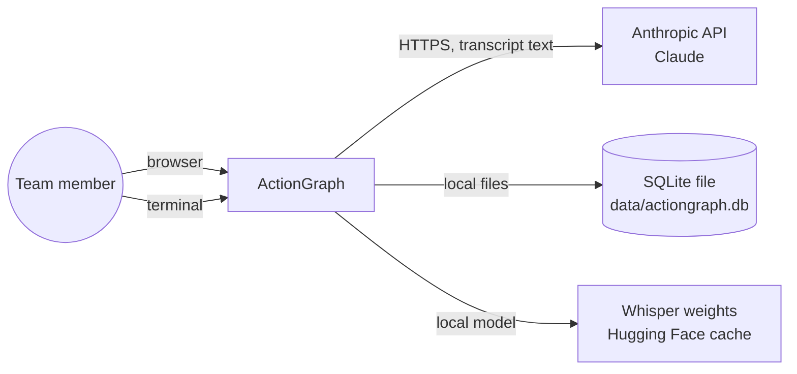
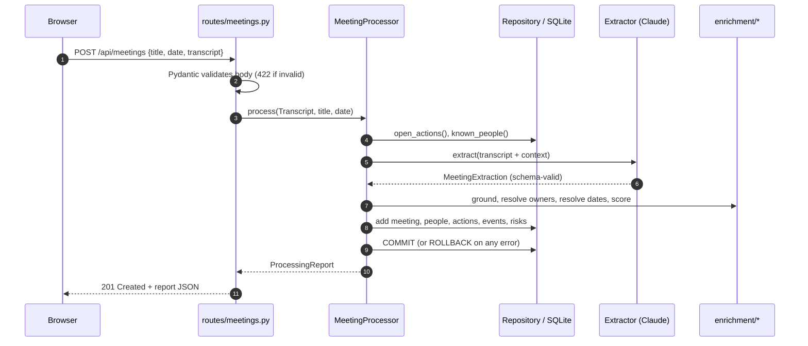

# Architecture

How ActionGraph is built *today*: the layers, the rules between them, and
how a request flows through the system. For *why* it is built this way, see
the [design doc](../design/DESIGN.md) and the [ADRs](../adr/README.md).

## 1. System context



Only one external service is involved (the Anthropic API), and only when
`ACTIONGRAPH_LLM_PROVIDER=anthropic`. Audio is transcribed locally.

## 2. Layers

```mermaid
flowchart TB
    subgraph L5[Interfaces]
        api[api/] --- cli[cli.py] --- web[web/]
    end
    subgraph L4[Services]
        services[services/: pipeline, tracking, review]
        graph[graph/]
        evaluation[evaluation/]
    end
    subgraph L3[Infrastructure]
        storage[storage/]
    end
    subgraph L2[Core logic]
        ingestion[ingestion/] --- extraction[extraction/] --- enrichment[enrichment/]
    end
    subgraph L1[Domain]
        domain[domain/: enums, schemas]
    end
    L5 --> L4 --> L3
    L4 --> L2
    L3 --> L1
    L2 --> L1
```

| Layer | Package | Responsibility | May import |
|-------|---------|----------------|-----------|
| Domain | `domain/` | Vocabulary and the LLM output contract | nothing internal |
| Core logic | `ingestion/`, `extraction/`, `enrichment/` | Turn inputs into verified, enriched data | domain |
| Infrastructure | `storage/` | Persist and query | domain, enrichment types |
| Services | `services/`, `graph/`, `evaluation/` | Orchestrate core + storage into use cases | everything below |
| Interfaces | `api/`, `cli.py`, `web/` | Translate HTTP / terminal / browser into service calls | services and below |

**The dependency rule:** arrows point *down* only. `enrichment` never
imports `storage`; `services` never imports `api`. Two practical results:

1. **Testability.** Everything in core logic is a pure function or a small
   class that runs without a database or network, which is why most tests are
   fast unit tests.
2. **Replaceability.** You can swap the LLM provider (implement `Extractor`),
   the database (change the URL), or add a new interface (e.g. a Slack bot)
   without touching the layers below.

## 3. Key abstractions

| Abstraction | Where | Why it exists |
|-------------|-------|---------------|
| `Transcript` | `ingestion/transcript.py` | One shape for every input format |
| `MeetingExtraction` | `domain/schemas.py` | The contract between the LLM and the rest of the system |
| `Extractor` (Protocol) | `extraction/base.py` | Decouples the pipeline from any specific LLM; enables fakes in tests and offline mode |
| `OwnerResolution`, `DeadlineResolution`, `GroundingResult`, `ReviewDecision` | `enrichment/` | Small immutable results that carry a value **and** its confidence/explanation |
| `Repository` | `storage/repository.py` | All queries in one place, named by meaning |
| `MeetingProcessor` | `services/pipeline.py` | The use case "process one meeting" |
| `ReviewService` | `services/review.py` | The use cases "approve / reject / edit" |
| `create_app()` | `api/app.py` | App factory: each test gets an isolated app and database |

## 4. Request lifecycle: `POST /api/meetings`



Error path: any `ActionGraphError` raised anywhere is turned into JSON by the
handler in `api/app.py`:

| Error | HTTP status | Meaning |
|-------|-------------|---------|
| `NotFoundError` | 404 | No such record |
| `UnsupportedFileTypeError` | 415 | Upload type not allowed |
| `IngestionError` | 400 | File unreadable / empty |
| `InvalidOperationError` | 409 | Valid request, wrong state (e.g. approving a stale update) |
| `ExtractionRefusedError` | 422 | The model declined the content |
| `ExtractionError` | 502 | The upstream LLM failed |
| `ConfigurationError` | 500 | Server misconfigured |

## 5. Folder map

```text
src/actiongraph/
├── __init__.py               version + package map
├── __main__.py               `python -m actiongraph`
├── config.py                 Settings from env/.env (pydantic-settings)
├── errors.py                 Exception hierarchy
├── logging_setup.py          Log format
├── domain/
│   ├── enums.py              ActionStatus, ReviewStatus, EventType, ...
│   └── schemas.py            MeetingExtraction and friends (LLM contract)
├── ingestion/
│   ├── transcript.py         Segment, Transcript
│   ├── loaders.py            txt / vtt / srt / json parsers
│   └── speech_to_text.py     Whisper (optional)
├── extraction/
│   ├── base.py               Extractor protocol, request/result types
│   ├── prompts.py            System prompt + user message builder
│   ├── anthropic_extractor.py
│   ├── rule_based.py         Offline baseline
│   └── factory.py            build_extractor(settings)
├── enrichment/
│   ├── text_utils.py         normalise, similarity, best_match
│   ├── grounding.py          evidence verification
│   ├── entity_resolution.py  people
│   ├── temporal.py           dates
│   └── confidence.py         review routing
├── storage/
│   ├── database.py           engine, sessions
│   ├── models.py             ORM tables
│   └── repository.py         queries
├── services/
│   ├── pipeline.py           MeetingProcessor
│   ├── tracking.py           cross-meeting helpers
│   └── review.py             ReviewService
├── graph/builder.py          nodes/edges, Mermaid
├── evaluation/               metrics.py, runner.py
├── api/                      app.py, deps.py, schemas.py, routes/
├── web/                      index.html, app.js, styles.css
└── cli.py                    Typer commands
```

## 6. Configuration and environments

All configuration is environment variables (12-factor style), loaded by
`config.Settings`. The same code runs in tests (temporary SQLite, offline
extractor, `_env_file=None`), locally (`.env`), and in any future deployment
(real environment variables). See [CONFIGURATION.md](../guides/CONFIGURATION.md).

## 7. Scaling path (not needed yet)

| Pressure | Change |
|----------|--------|
| Long audio blocks requests | Move `MeetingProcessor.process` to a worker (RQ/Celery/Arq); return a job id |
| Many concurrent users | PostgreSQL via `ACTIONGRAPH_DATABASE_URL`; run Uvicorn with several workers |
| Schema changes in production | Alembic migrations instead of `create_all` |
| Large backfills | Message Batches API (asynchronous, cheaper) for bulk extraction |
| Deep graph queries (many hops) | Revisit [ADR-0003](../adr/0003-relational-storage-for-the-graph.md) (graph DB or recursive CTEs) |
