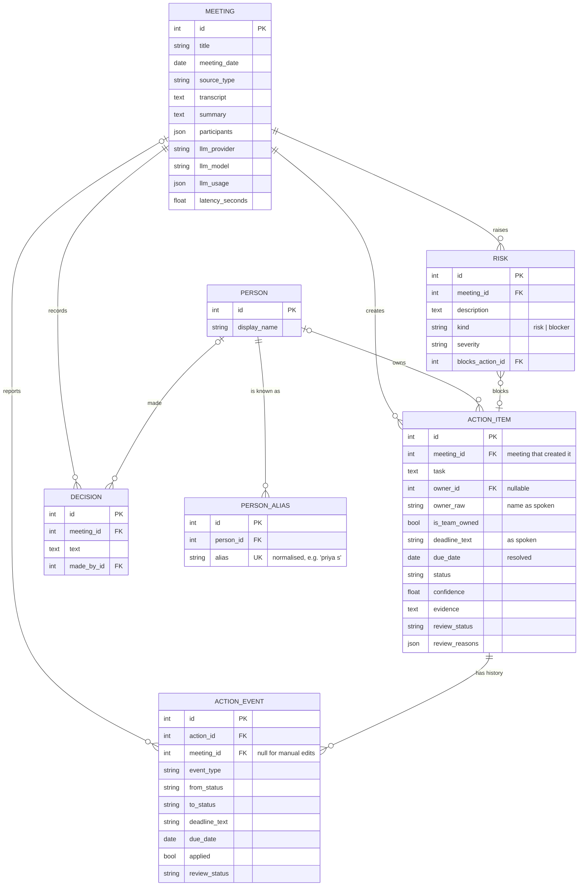
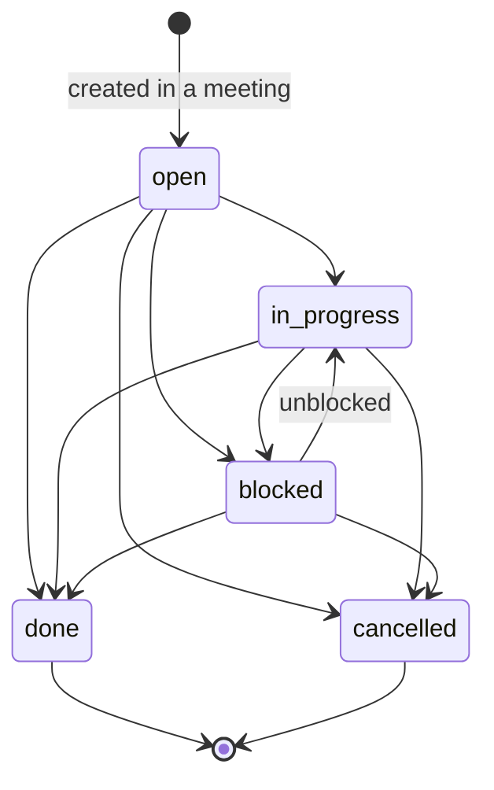
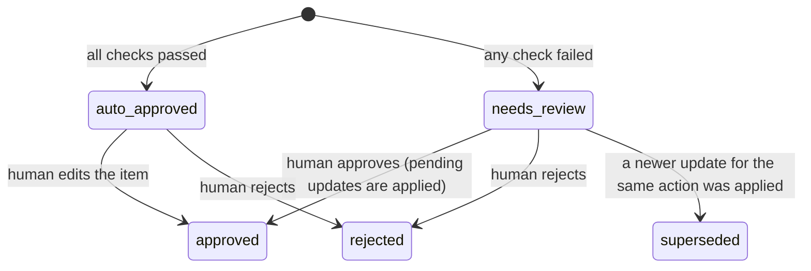

# Data model

Tables are defined in `src/actiongraph/storage/models.py` (SQLAlchemy 2.0).
Enum-like columns store the string values from `domain/enums.py`.

## Entity-relationship diagram

`ActionItem`, `Decision`, `Risk` and `ActionEvent` also share the
*reviewable* columns from `ReviewableMixin`: `confidence`, `evidence`,
`review_status`, `review_reasons`, `created_at`.

## Design notes

**Raw and resolved values are both kept.** `owner_raw` ("@priya") and
`owner_id` (Priya Sharma); `deadline_text` ("by Friday") and `due_date`
(2026-09-11). The raw value is evidence; the resolved value is what we track.
A reviewer can always see what was actually said.

**History is append-only.** Status is not just overwritten; every change is an
`ActionEvent`. The current `ActionItem.status` is a convenience copy of the
latest applied event. This gives the cross-meeting timeline for free and an
audit trail of who/what changed what.

**Proposals vs. facts.** An event with `applied = false` is a *proposal*
waiting for review; it does not affect the action until approved.

**Rejected is hidden, not deleted.** Rejected items stay in the database
(useful for auditing and for building evaluation data from real mistakes) but
are excluded from tracking queries and the graph.

## Action status state machine

Transitions come from a meeting (status update) or a human edit. A deadline
change keeps the status and is recorded as a `deadline_changed` event
("postponed"). `done` and `cancelled` are *closed*: closed actions are no
longer sent to the extractor as context.

## Review status state machine

## Event types

| `event_type` | Created when | Changes the action? |
|--------------|-------------|---------------------|
| `created` | an action is first extracted | – (it is the creation) |
| `status_changed` | a later meeting reports progress | yes, once applied |
| `deadline_changed` | a later meeting moves the deadline | yes, once applied |
| `mentioned` | discussed again with no change, or a duplicate was folded in | no |
| `edited` | a human edits the action | yes (immediately) |

## Indexes

Foreign keys used for filtering are indexed: `action_items.meeting_id`,
`owner_id`, `status`; `action_events.action_id`; `decisions.meeting_id`;
`risks.meeting_id`; `person_aliases.alias` (unique).
