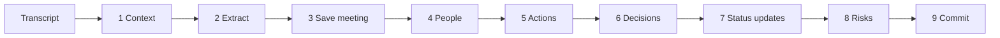

# Pipeline walkthrough: one meeting, every stage

This document follows **one real example**, the second sample meeting
(`samples/transcripts/2026-09-14_sprint-14-sync.txt`), through
`MeetingProcessor._process` in `src/actiongraph/services/pipeline.py`, showing
the data at each stage. Keep the code open side by side; the stage numbers
match the comments in the file.



## Input

```text
Alex Kim: The API design doc is done. I shared the final version with the backend team on Thursday.
Priya S.: The authentication changes are blocked. We're waiting on the security team to approve ...
Maya Chen: That's a blocker. I'll escalate the credentials request to the security lead today.
Sam Lee: The user research is mostly written, but I need a few more days. Can we push it to next Wednesday?
...
Maya Chen: Good. @priya, once the credentials arrive, please pair with Alex on the staging config.
```

Meeting date: **Monday 2026-09-14**. Meeting 1 already created five actions.

## Stage 1: Load context from earlier meetings

```python
open_actions = self.repo.open_actions()          # not done/cancelled, not rejected
resolver = EntityResolver(self.repo.known_people())
```

| id | task | owner | deadline | status |
|----|------|-------|----------|--------|
| 1 | Handle the authentication changes | Priya Sharma | – | open |
| 2 | Update the API design | Team | by Friday | open |
| 3 | Share the user research | Sam Lee | by Wednesday | open |
| 4 | Summarize the top five pain points… | Sam Lee | – | open |
| 5 | Set up the new staging environment | Alex Kim | by end of next week | open |

Known people: Maya Chen, Priya Sharma (aliases `priya`, `priya sharma`), Sam Lee, Alex Kim.

**Why:** the extractor can only report "auth is blocked" as an *update to #1*
if it knows #1 exists. Without this context it would create duplicates.

## Stage 2: Extraction (the only LLM call)

The extractor receives the transcript plus the table above (rendered by
`prompts.build_user_message`) and returns a `MeetingExtraction`, e.g.:

```json
{
  "status_updates": [
    {"action_id": 2, "new_status": "done",        "evidence": "The API design doc is done.", "confidence": 0.95},
    {"action_id": 1, "new_status": "blocked",     "evidence": "The authentication changes are blocked.", "confidence": 0.95},
    {"action_id": 3, "new_status": "in_progress", "new_deadline_text": "next Wednesday",
     "evidence": "Can we push it to next Wednesday?", "confidence": 0.85}
  ],
  "actions": [
    {"task": "Escalate the credentials request to the security lead", "owner": "Maya Chen",
     "deadline_text": "today", "evidence": "I'll escalate the credentials request to the security lead today.", "confidence": 0.95},
    {"task": "Pair with Alex on the staging config", "owner": "@priya",
     "deadline_text": "once the credentials arrive", "evidence": "...please pair with Alex on the staging config.", "confidence": 0.85}
  ],
  "risks": [
    {"description": "Security team approval of OAuth client credentials is blocking authentication",
     "kind": "blocker", "blocks_task": "Handle the authentication changes", "...": "..."}
  ],
  "decisions": [{"decision": "Freeze new feature requests until the beta ships", "...": "..."}]
}
```

Nothing has been written to the database yet. If this call fails, the
meeting is simply not processed.

## Stage 3: Save the meeting

A `Meeting` row with the transcript, summary, provider/model, latency and
token usage. `session.flush()` assigns `meeting.id` **without committing**.

## Stage 4: Resolve people

```python
for name in [*transcript.speakers, *extraction.participants]:
    resolver.resolve(name)                      # "Priya S." -> Priya Sharma (partial match)
action_owners = [resolver.resolve(a.owner) for a in extraction.actions]
```

| Raw name | Rule | Result |
|----------|------|--------|
| `Priya S.` | compatible with `priya sharma` | Priya Sharma (0.9), alias `priya s` added |
| `Maya Chen` | exact alias | Maya Chen (1.0) |
| `@priya` | normalises to `priya`, an exact alias | Priya Sharma (1.0) |

New people and new aliases are saved so the next meeting knows them.

## Stage 5: New actions

For each extracted action:

```python
grounding = ground_evidence(item.evidence, text)          # 1.0: quote found verbatim
deadline  = resolve_deadline(item.deadline_text, meeting_date)
review    = review_action(item.confidence, grounding, owner, deadline, threshold)
duplicate = find_duplicate(item.task, owner_id, open_actions)
```

| Task | Deadline → date | Review | Why |
|------|-----------------|--------|-----|
| Escalate the credentials request… | today → 2026-09-14 (0.95) | auto_approved | every check passed |
| Pair with Alex on the staging config | "once the credentials arrive" → **none** | **needs_review** | *Deadline 'once the credentials arrive' could not be converted to a calendar date.* |

Each new action also gets a `created` event, the first entry in its timeline.

## Stage 6: Decisions

Grounded and scored like actions, without owner/date checks.

## Stage 7: Status updates on earlier actions

```python
action = open_by_id.get(update.action_id)        # unknown id -> warning, skipped
review = review_item(update.confidence, grounding, threshold,
                     extra_reasons=deadline_reasons(deadline))
event  = ActionEvent(from_status=action.status, to_status=update.new_status, applied=False, ...)
if not review.needs_review:
    apply_event(event)                           # action.status changes now
```

| Action | Change | Result |
|--------|--------|--------|
| #2 API design | open → done | applied |
| #1 Authentication | open → blocked | applied |
| #3 User research | deadline → "next Wednesday" (= Wed 23 Sep, **ambiguous**, 0.65) | **pending review**: action unchanged until a human approves |

## Stage 8: Risks and blockers

```python
blocked = find_blocked_action(item.blocks_task, new_actions + open_actions)
```

"Handle the authentication changes" matches action #1 → `risk.blocks_action_id = 1`,
which becomes a `BLOCKS` edge in the graph.

## Stage 9: Commit

`process()` commits once. Any exception in stages 3–8 triggers a rollback,
so the database never contains half a meeting.

## Output: the `ProcessingReport`

Illustrative output (the numbers are examples, not measurements):

```text
Processed 'Sprint 14 Sync' -> meeting #2 (anthropic/claude-opus-5-5, 21.4s)
  2 actions, 1 decisions, 1 risks | 4 status updates applied, 1 pending | 0 duplicates merged | 2 need review
  tokens: 2140 in / 1150 out (0 read from cache)
```

Run `actiongraph demo` to see real numbers for your extractor; the offline
extractor produces a similar but not identical result.

## What happens next

- In the **review queue**, a human approves or edits the two flagged items.
- In **meeting 3**, the open-action list now shows #1 as *blocked*; when Priya
  says "Authentication is completed", the update `blocked → done` is applied,
  and the stale "next Wednesday" proposal for #3 is marked *superseded* once
  #3 is reported done.
