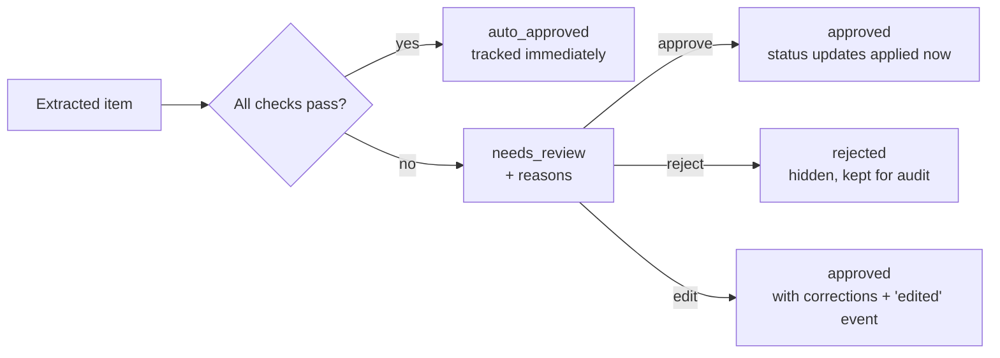

# 06. Human-in-the-loop (HITL): confidence, reasons, review

## What it is
A design where automation handles the clear cases and **hands uncertain cases
to a person**, instead of either doing everything automatically or asking a
human about everything.

## Why it matters
The cost of mistakes is asymmetric. A missed action can be added by hand. A
wrong action ("Sam owes the report by Friday") triggers reminders to someone
who never agreed to it. HITL lets us automate most items *and* keep trust.

## How ActionGraph does it

**Checks** (`enrichment/confidence.py`), each producing a readable reason when it fails:

| Check | Example reason |
|-------|----------------|
| LLM confidence ≥ threshold (0.7) | *Confidence 0.40 is below the review threshold 0.70.* |
| Evidence grounded | *Evidence quote not found in the transcript (match 31%)…* |
| Owner identified (actions) | *No owner was identified; unowned work is rarely done.* |
| Owner unambiguous | *Owner 'Priya' is ambiguous: could be Priya Kumar, Priya Sharma.* |
| Deadline resolvable | *Deadline 'before the next release' could not be converted to a calendar date.* |
| Deadline unambiguous | *Deadline 'next Friday' was read as Fri 18 Sep 2026 (…); please confirm.* |

**Proposals vs. facts.** A status update that needs review is stored as an
*unapplied* event. The action keeps its old status until a human approves.
If a newer update is applied first, the old proposal becomes `superseded`,
and approving a stale proposal is refused (`409 Conflict`).

## Design choices worth discussing
- **Why a threshold *and* reasons?** The threshold is a single tuning knob; the reasons make each review take seconds instead of minutes.
- **Why not trust model confidence alone?** Self-reported confidence is a useful but imperfect signal. It is combined with independent, objective checks (grounding, resolution).
- **Precision vs. workload:** raising `ACTIONGRAPH_REVIEW_THRESHOLD` sends more items to review (fewer mistakes, more human work). Measure both before changing it.
- **Rejections are data.** Rejected items are kept; they are the best source of new evaluation cases.

## Try it
1. `actiongraph demo --provider offline`, then `actiongraph review --db data/demo.db`.
2. Approve the pending status update (`actiongraph approve event <id> --db data/demo.db`) and run `actiongraph timeline <action id>` to see it applied.
3. Set `ACTIONGRAPH_REVIEW_THRESHOLD=0.9` and rerun the demo. How many more items need review?
