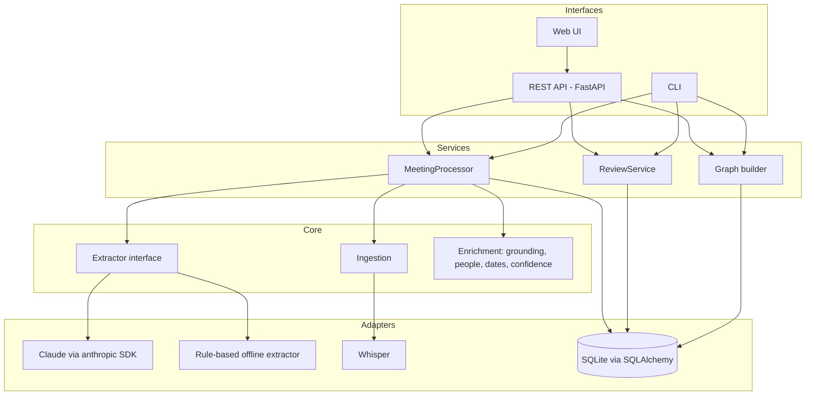

# Design document: ActionGraph

| | |
|---|---|
| **Status** | Implemented (v0.1.0) |
| **Last updated** | 2026-10-03 |
| **Audience** | Engineers building on or reviewing ActionGraph |
| **Related** | [Architecture](../architecture/ARCHITECTURE.md) · [ADRs](../adr/README.md) · [Evaluation](../guides/EVALUATION.md) |

---

## 1. Context and problem

Teams agree on work in meetings, then lose it. Notes are incomplete,
owners are implied ("we should…"), deadlines are relative ("by Friday"), and
nobody connects this week's "auth is blocked" to last week's "Priya will
build auth". Meeting *summarisers* produce prose, which is pleasant to read
and impossible to track.

**Problem statement:** convert unstructured meeting conversation into
structured, trustworthy, *trackable* records (decisions, action items with
owners and dates, risks), and keep those records current across a series of
meetings, without asking anyone to fill in a form.

## 2. Goals and non-goals

### Goals

| ID | Goal | Measured by |
|----|------|-------------|
| G1 | Extract decisions, action items, owners, deadlines and risks from a transcript as schema-valid data | 100% of LLM responses validate against `MeetingExtraction` (enforced by structured outputs + Pydantic) |
| G2 | Resolve people and dates to canonical values | Owner and deadline accuracy in `actiongraph eval` |
| G3 | Track each action across meetings (progress, blockers, completion, postponement) | Status-update F1 in `actiongraph eval`; `tests/integration/test_pipeline.py` |
| G4 | Never silently create a wrong task: uncertain items go to a human | Every auto-approved item passed all checks in `enrichment/confidence.py` |
| G5 | Accept audio, video, subtitles and plain text | Loader tests per format |
| G6 | Be runnable and learnable without an API key or cloud services | Full test suite and demo run offline |

### Non-goals (for v0.1)

- **Real-time / live meeting capture.** We process recordings and transcripts after the meeting.
- **Speaker diarization.** Whisper gives text without speaker names; see §9.
- **Multi-user auth, permissions, multi-tenancy.** Single-user, local deployment.
- **Task-manager replacement.** We extract and track; pushing to Jira/Linear is future work.
- **Perfect recall.** We deliberately trade recall for precision (G4).

## 3. Requirements

**Functional**
1. Ingest `.txt/.md`, `.vtt/.srt`, `.json` transcripts and common audio/video formats.
2. Extract new action items, decisions, risks/blockers, and status updates to open actions.
3. Resolve owner names to people; resolve deadline phrases to dates relative to the meeting date.
4. Verify every extracted item against the transcript (evidence grounding).
5. Route low-confidence items to a review queue; support approve, reject and edit.
6. Show each action's history across meetings; expose the whole graph.
7. Provide a REST API, a CLI and a web UI.

**Non-functional**
- *Correctness over coverage:* a missed item is cheaper than an invented one.
- *Determinism where possible:* everything except the LLM call is reproducible and unit-tested.
- *Atomicity:* processing a meeting either fully succeeds or leaves no trace.
- *Cost awareness:* one LLM call per meeting; prompt caching on the stable prefix.
- *Explainability:* every review flag carries a human-readable reason.

## 4. Design overview

**The central idea is a division of labour.** The LLM handles the task
only it can do: understanding informal language ("leave that with me" is a
commitment; "we could maybe…" is not). Deterministic code handles every
task that must be exact and auditable: date arithmetic, identity, quote
verification, routing decisions, persistence. Each LLM output is treated as a
*proposal* that code verifies before it becomes data.

## 5. Detailed design

### 5.1 Ingestion
`load_transcript(path)` dispatches on file extension to a small parser that
returns a `Transcript` (a list of `Segment(speaker, text, start, end)`).
Subtitle cues from the same speaker are merged into turns. Audio is
transcribed locally with `faster-whisper` (int8 on CPU, VAD filter to skip
silence). See [concepts/08-speech-to-text.md](../concepts/08-speech-to-text.md).

### 5.2 Extraction contract
The output schema `MeetingExtraction` (`domain/schemas.py`) contains
`summary`, `participants`, `decisions[]`, `actions[]`, `risks[]` and
`status_updates[]`. Key rules, each with a reason:

| Rule | Reason |
|------|--------|
| All fields required, nullable where needed | Explicit `null` is less ambiguous than a missing key |
| `deadline_text` is a verbatim phrase, not a date | LLMs make calendar mistakes; code does not ([ADR-0005](../adr/0005-deterministic-temporal-resolution.md)) |
| Every item has a verbatim `evidence` quote | Enables automatic hallucination detection (§5.4) |
| Every item has a calibrated `confidence` | Input to review routing (§5.6) |
| Status updates reference ids from a provided list | Lets code reject invented ids |

### 5.3 LLM call
One request per meeting to `claude-opus-5-5` using **structured outputs**
(`client.beta.messages.parse(output_format=MeetingExtraction)`): the API
constrains decoding to the JSON schema and the SDK validates the reply into
Pydantic objects ([ADR-0004](../adr/0004-structured-outputs.md)).

- *Prompt:* a stable system prompt (cached with `cache_control`) and a user message containing, in order, the transcript, meeting metadata, known people and open action items from earlier meetings. See [PROMPT_ENGINEERING.md](../guides/PROMPT_ENGINEERING.md).
- *Effort:* `output_config.effort = "medium"` (configurable), a cost/quality trade-off chosen for a reading-comprehension task.
- *Refusals:* server-side fallback (`fallbacks="default"`) is enabled by default; `stop_reason == "refusal"` raises `ExtractionRefusedError`.
- *Truncation:* `stop_reason == "max_tokens"` raises instead of storing partial data.
- *Errors:* SDK exceptions are translated into `ExtractionError` with actionable messages; the SDK already retries 429/5xx with backoff.
- *Context size:* a transcript of a multi-hour meeting is well inside the model's context window, so v0.1 sends the whole transcript in one call (no chunking). This keeps cross-references ("as Sam said earlier") intact.

### 5.4 Grounding
`ground_evidence(quote, transcript)` normalises both texts and scores the
fraction of quote words found, in order, in one nearby window of the
transcript (1.0 = exact). Below 0.8 the item is flagged and its confidence is
capped at the grounding score. See [concepts/03](../concepts/03-grounding-and-hallucinations.md).

### 5.5 Entity and temporal resolution
- **People:** a resolver walks an ordered rule ladder (team words → exact alias → compatible name → fuzzy spelling → new person) and **refuses to guess** when a name matches several people. Every spelling seen is stored as an alias. See [concepts/04](../concepts/04-entity-resolution.md).
- **Dates:** an ordered list of rules converts phrases to dates relative to the meeting date. Each result carries a confidence and a plain-English rule; ambiguous phrases ("next Friday") get < 0.7; event-relative phrases ("before the next release") stay unresolved. See [concepts/05](../concepts/05-temporal-reasoning.md).

### 5.6 Confidence and review routing
An item is auto-approved only if *all* hold: LLM confidence ≥ threshold
(default 0.7), evidence grounded, owner resolved unambiguously (actions),
deadline resolved with confidence ≥ 0.7 when one was stated (actions and
updates). Otherwise it is stored with `review_status = needs_review` and a
list of reasons. Status updates that need review are stored as **unapplied
events** and only change the action when approved ([ADR-0006](../adr/0006-confidence-based-human-review.md)).

### 5.7 Cross-meeting tracking
Before extraction, the pipeline loads all open (not done/cancelled, not
rejected) actions and passes them, with ids, to the extractor. The model
reports `status_updates` against those ids. Safeguards:
- unknown ids → discarded with a warning (hallucination);
- a "new" action that matches an open action with the same owner (similarity ≥ 0.75) → folded into the existing one as a `mentioned` event;
- applying a newer update marks older pending proposals for the same action `superseded`;
- risks name the task they block; code links them to the most similar action (≥ 0.5).

### 5.8 Storage and the graph
Relational tables (SQLite by default) with foreign keys represent the graph:
`Meeting`, `ActionItem`, `Person`/`PersonAlias`, `Decision`, `Risk`,
`ActionEvent`. The graph view (nodes/edges, Mermaid export) is *derived* on
request, so it cannot drift from the data ([ADR-0003](../adr/0003-relational-storage-for-the-graph.md),
[DATA_MODEL.md](../architecture/DATA_MODEL.md)).

### 5.9 Interfaces
FastAPI app built by a factory (`create_app`) with dependency-injected
session, settings and extractor; a Typer CLI over the same services; a
dependency-free single-page UI served as static files.

## 6. Alternatives considered

| Decision | Alternative | Why not (for now) |
|----------|-------------|-------------------|
| Structured outputs | Ask for JSON in the prompt and parse it | No guarantee of valid JSON; needs retry/repair logic ([ADR-0004](../adr/0004-structured-outputs.md)) |
| One call per meeting | Separate calls per item type (actions, decisions, …) | 4× cost and latency; loses cross-item context (a risk that blocks an action) |
| One call per meeting | Agent with tools (search DB, create task) | Less predictable, costlier, harder to test and review. The task is well-specified, so the simplest tier that works (a single call) wins |
| Code resolves dates | LLM outputs ISO dates | Off-by-one weekday errors; unexplainable ([ADR-0005](../adr/0005-deterministic-temporal-resolution.md)) |
| Relational DB | Neo4j / graph database | Extra infrastructure for queries that are 1–2 hops deep ([ADR-0003](../adr/0003-relational-storage-for-the-graph.md)) |
| Confidence threshold + reasons | Auto-accept everything; let users delete mistakes | Erodes trust; mistakes trigger real reminders to real people |
| Local Whisper | Cloud speech-to-text API | Meeting audio is sensitive; local keeps it on the machine |
| SQLite | PostgreSQL from day one | Zero setup for learners; SQLAlchemy makes the switch a URL change |

## 7. Cross-cutting concerns

### Security
- **Prompt injection:** transcripts are untrusted. The system prompt tells the model to treat instruction-like text as speech; status updates may only reference ids we supplied; every item is grounded. Eval case `05-brainstorm-adversarial` contains an injection attempt.
- **XSS:** the UI escapes all API-provided text before inserting HTML (`esc()` in `web/app.js`).
- **Secrets:** API keys only via environment / `.env` (git-ignored), held as `SecretStr` so they never appear in logs.
- **Uploads:** file types are allow-listed; files are written to a temporary directory and deleted after parsing.

### Privacy
Transcripts contain personal data. They are stored locally in SQLite and sent
only to the configured LLM provider. Audio never leaves the machine. A
production deployment would add retention limits, deletion endpoints and
access control.

### Reliability
- Single transaction per meeting; LLM failure leaves the DB untouched (tested).
- SDK retries transient API errors; our errors map to meaningful HTTP codes (502 for upstream LLM failure).
- Processing is synchronous; a multi-user deployment needs a job queue (§9).

### Cost
- One request per meeting. Token usage (including cache reads) is recorded per meeting in `meetings.llm_usage` and shown by the CLI.
- The system prompt is marked for caching; caching takes effect once the cached prefix exceeds the model's minimum cacheable length.
- `effort` is configurable; lower it for cheaper bulk processing and verify with `actiongraph eval`.

### Observability
Structured log lines per stage (provider, model, latency, token counts,
counts per item type). Each meeting stores provider, model, latency and usage.

### Testing and evaluation
- 160 automated tests (unit + integration), ~96% line coverage, no network needed.
- LLM quality is measured separately with a labelled dataset and precision/recall/F1, including a held-out case ([EVALUATION.md](../guides/EVALUATION.md)).

## 8. Risks and mitigations

| Risk | Likelihood | Impact | Mitigation |
|------|-----------|--------|------------|
| Model invents an action | Medium | High | Grounding check, confidence threshold, review queue |
| Wrong person assigned | Medium | High | Ambiguity detection, fuzzy matches flagged, edit UI |
| Wrong due date | Medium | Medium | Deterministic resolver, ambiguous phrases flagged |
| Duplicate actions across meetings | Medium | Medium | Open items in prompt + similarity-based de-duplication |
| Evaluation set too small / overfit | High | Medium | Held-out case, documented limitation, guidance for adding cases |
| API outage or refusal | Low | Medium | SDK retries, server-side fallback, offline extractor |

## 9. Future work

1. **Speaker diarization** (e.g. pyannote) to attribute "I'll do it" in audio.
2. **Asynchronous processing** with a job queue and progress polling.
3. **Semantic matching** (embeddings or LLM-as-judge) for de-duplication and evaluation.
4. **Migrations** (Alembic) and PostgreSQL for multi-user deployments.
5. **Integrations:** push approved actions to issue trackers; reminders before due dates.
6. **Batch re-processing** with the Message Batches API for cheaper bulk evaluation.

## 10. Open questions

- Should a postponement *always* require review, since it changes a commitment?
- How should we treat actions owned by people outside the meeting (e.g. "legal")?
- What retention policy is appropriate for raw transcripts once items are approved?
